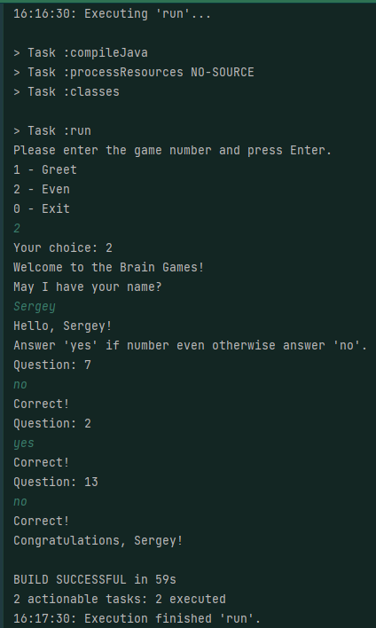
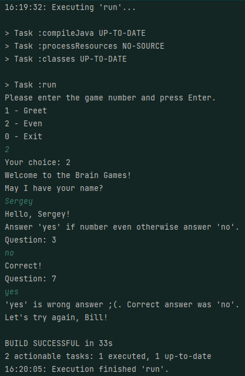
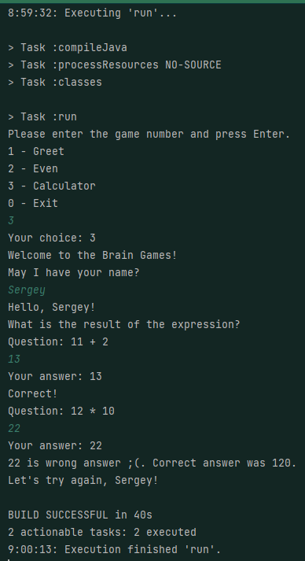
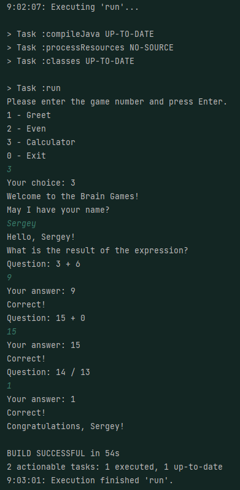
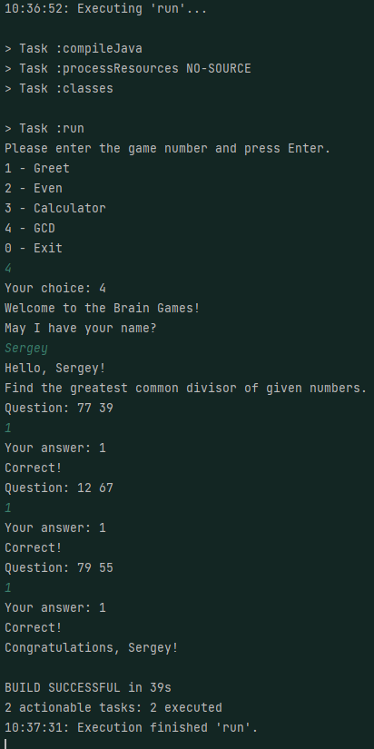
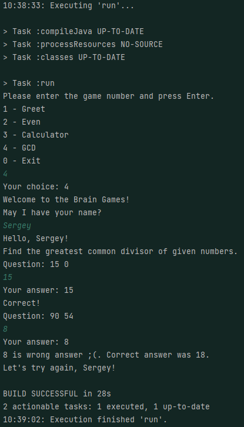
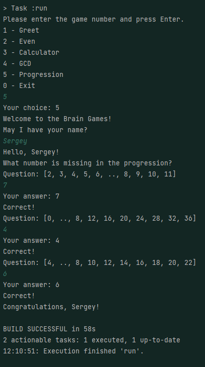
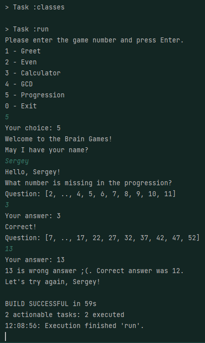
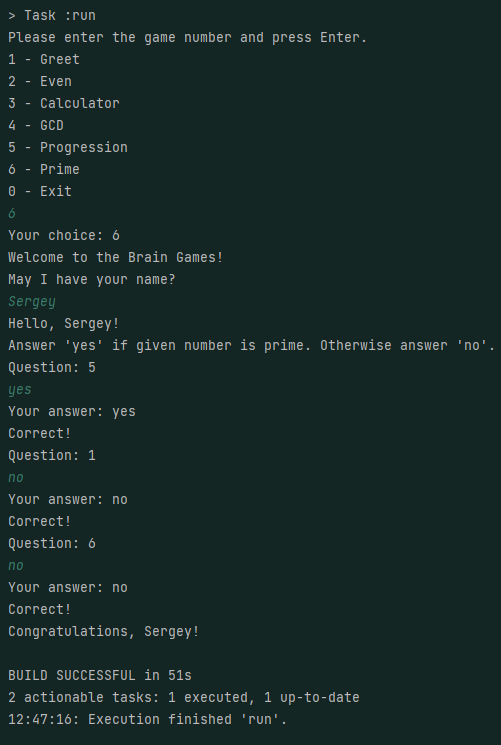

### Hexlet tests and linter status:

#Игра: "Проверка на чётность".

#Случай, если пользователь даст верный ответ.

#Случай, если пользователь даст неверный ответ.

#Игра: "Калькулятор".

#Случай, если пользователь даст неверный ответ.

#Случай, если пользователь даст верный ответ.

#Игра: "Наибольший общий делитель (НОД)".

#Случай, если пользователь даст верный ответ.

#Случай, если пользователь даст неверный ответ.

#Игра: "Арифметическая прогрессия".

#Случай, если пользователь даст верный ответ.

#Случай, если пользователь даст неверный ответ.

#Игра: "Арифметическая прогрессия".

#Случай, если пользователь даст неверный ответ.

#Случай, если пользователь даст верный ответ.

